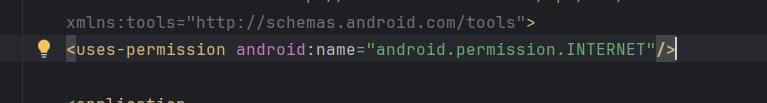
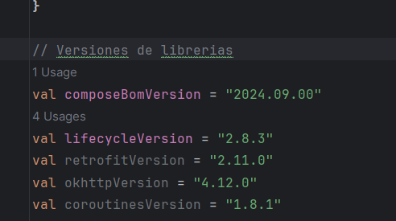
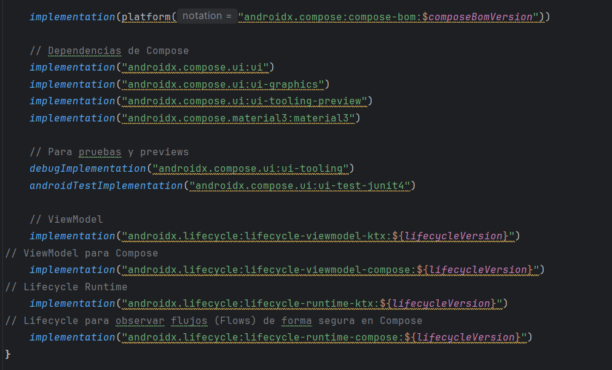
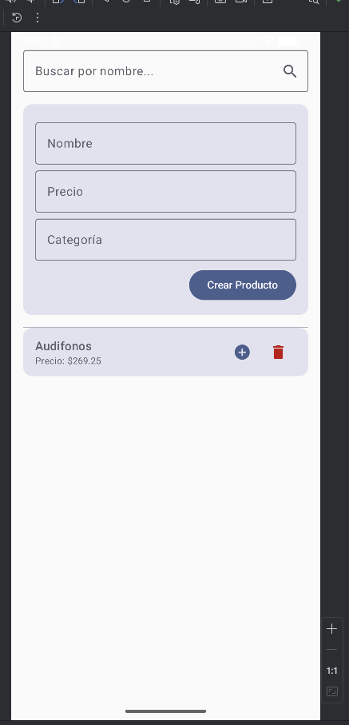
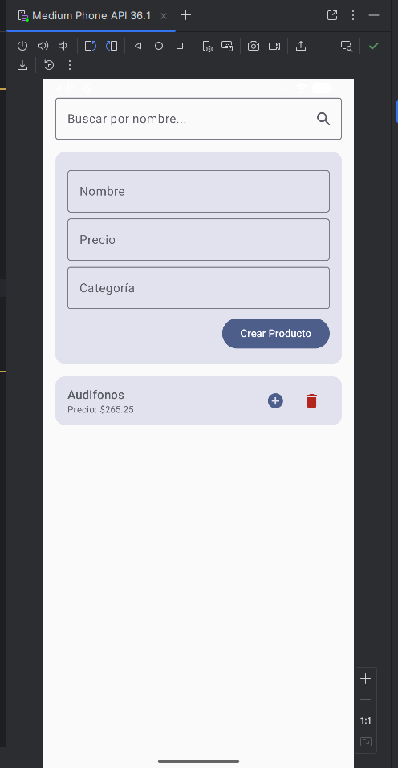
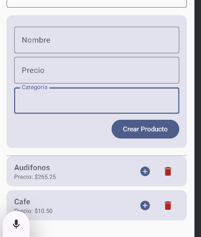
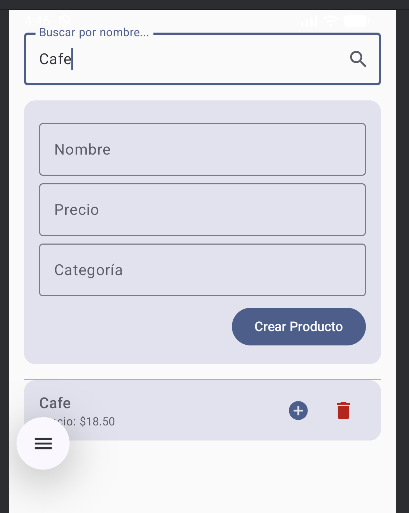
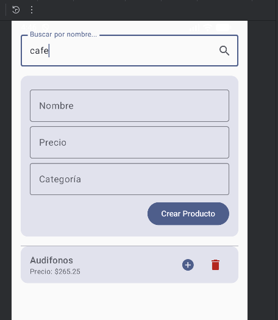

## Conectividad Móvil ##

# Prompts clave #
“Quiero una app Android (Kotlin, Compose) que consuma un API REST en http://10.0.2.2:8080/ con endpoints de productos (GET/POST/PUT/DELETE y búsqueda por nombre). Sugiere la arquitectura MVVM + Repository + Retrofit y dame la lista de archivos a crear (paquetes, clases) con una breve descripción de cada uno.”

“Genérame el data class Product con propiedades id: Long?, name: String, price: Double, category: String?, createdAt: String?, y un ProductRequest (name, price, category). Comenta por qué id y createdAt son opcionales.”

“Define una interfaz ProductApi con Retrofit para estos endpoints exactos (lista, get por id, create, update, delete, search con productName). Luego crea un RetrofitInstance con base URL http://10.0.2.2:8080/, GsonConverterFactory y logging de OkHttp en nivel BODY.”

“Crea una clase ProductRepository que use RetrofitInstance.api y exponga funciones listAll, get, create, update, delete, search. Solo delega, sin lógica extra.”

“Crea un ProductViewModel con ProductUiState(loading, items, message) usando MutableStateFlow/StateFlow. Implementa loadAll, searchByName, create, update, delete con viewModelScope.launch y runCatching. Explica cómo actualizas la lista inmutable.”

“Dame una pantalla ProductsScreen(vm) que tenga: barra de búsqueda (nombre), formulario simple (name, price, category) para crear, una LazyColumn de productos con botones de actualizar rápido (+1.00 al precio) y eliminar. Usa collectAsStateWithLifecycle para el estado.”

“Propón casos de prueba manuales para verificar cada endpoint desde la app (crear, listar, actualizar, eliminar, buscar). Incluye qué debo ver en Logcat o UI al fallar la red.”

“Tengo error CLEARTEXT communication not permitted al llamar http://10.0.2.2:8080/. Dame pasos para solucionarlo en Android 9+ y cómo confirmar que el fix funcionó.”

“Sugiere 3 mejoras pequeñas: validación de precio, feedback de errores con Snackbar/Dialog, y formateo de moneda. Dame snippets puntuales.”

# Capturas de pantalla #

Se agrega permisos de conexión a internet en la aplicación.

Adición de librerias:

Pueba de aplicación y listado de productos.

Actualizar precio de producto.

Creción de nuevo producto.

Búsqueda de producto.

Eliminar producto.

# Explicación de MVVM + Retrofit #
MVVM y Retrofit son una combinación estándar para crear apps Android modernas. En resumen, MVVM organiza el código de tu app, mientras que Retrofit se encarga de hablar con internet.

¿Cómo Funcionan Juntos?

El flujo de trabajo es muy claro y ordenado:

La Vista (ProductsScreen) le dice al ViewModel: "¡Necesito la lista de productos!".

El ViewModel actualiza su estado a "cargando" y le dice al Modelo (ProductRepository): "Dame todos los productos".

El Repositorio sabe que los productos vienen de internet, así que usa su herramienta especializada: Retrofit (ProductApi).

Retrofit hace la llamada a la URL del API, recibe el JSON y lo convierte en una List<Product>.

La lista de productos viaja de vuelta: de Retrofit al Repositorio, y de ahí al ViewModel.

El ViewModel recibe la lista, actualiza su estado a "éxito" con los nuevos datos.

La Vista, que está observando el estado del ViewModel, detecta el cambio y se redibuja para mostrar la lista de productos al usuario.

# Errores encontrados #
1. No reconoce las anotaciones APIRest
2. No puede hacerse uso de la dependencia de Retrofit
_solución a problema 1 y 2:_ importar las dependencias correctamente.
3. Error CLEARTEXT
_solucíon al problema:_ añadiendo la propiedad android:usesCleartextTraffic="true" en la etiqueta application en el archivo AndroidManifest.xml
4. La función de actualizar no funciona
_solucíon al problema:_

# Reflexión #
En su mayoria ocupe la IA de Gemini y el uso que le di fue más para la construcción y bases del proyecto la mayor parte del tiempo pedia que me explicará y fueramos paso a paso desarrollando el proyecto, en algunas ocaciones tuve que recorrer a copiar código directamente que me proporcionaba más que todo en el tema de los import y del gradle.kts